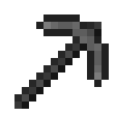

# late-miner
A dark-themed Minecraft resource pack.

## Download
You can download the latest release of the pack [here](https://github.com/jadc/late-miner/releases/tag/1.1).

Extract the zip file and drag the "late miner" folder into your Minecraft resources pack folder. (`%appdata%\.minecraft\resourcepacks`)

## Screenshots

